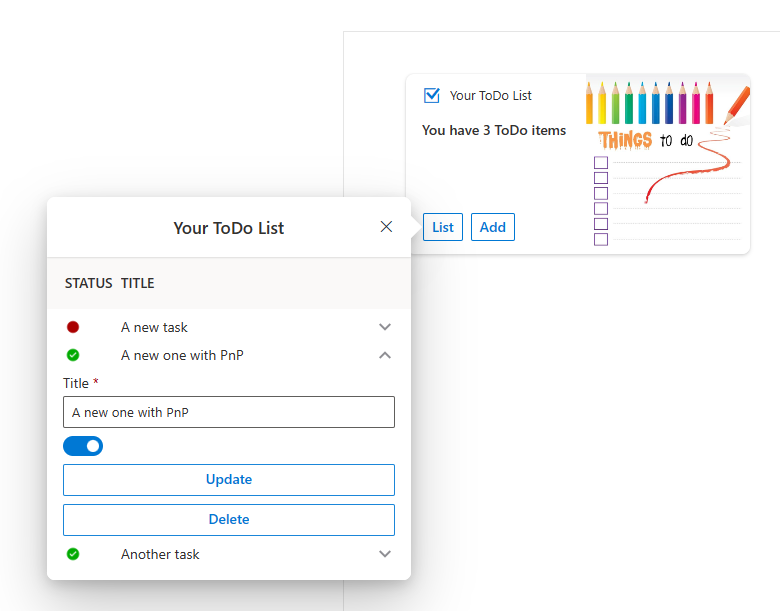

# Exposing business data in Microsoft 365 using Azure Data API builder

## Summary

This is a sample application that shows you how to expose business data in Microsoft Viva Connections consuming a back-end API implemented with the preview version of Azure Data API builder.

## Used SharePoint Framework Version

## Applies to

- [SharePoint Framework](https://aka.ms/spfx)
- [Microsoft 365 tenant](https://docs.microsoft.com/en-us/sharepoint/dev/spfx/set-up-your-developer-tenant)

> Get your own free development tenant by subscribing to [Microsoft 365 developer program](http://aka.ms/o365devprogram)

## Prerequisites

In order to use this sample solution, you will need to host a Data API builder model like the one defined [here](https://github.com/yorek/dab-microsoft365-demo). 

## Solution

Solution|Author(s)
--------|---------
ace-data-api-builder | Paolo Pialorsi - [PiaSys.com](https://www.piasys.com/) - [@PaoloPia](https://twitter.com/PaoloPia)
 | Davide Mauri - [Microsoft](https://www.microsoft.com/) - [@mauridb](https://twitter.com/mauridb)

## Version history

| Version | Date             | Comments        |
| ------- | ---------------- | --------------- |
| 1.0     | March 23, 2023   | Initial release |

## Disclaimer

**THIS CODE IS PROVIDED _AS IS_ WITHOUT WARRANTY OF ANY KIND, EITHER EXPRESS OR IMPLIED, INCLUDING ANY IMPLIED WARRANTIES OF FITNESS FOR A PARTICULAR PURPOSE, MERCHANTABILITY, OR NON-INFRINGEMENT.**

---

## Minimal Path to Awesome

- Clone this repository
- Ensure that you are at the solution folder
- in the command-line run:
  - **npm install**
  - **gulp serve**

> Include any additional steps as needed.

## Features

To learn more about this sample, please watch the following video:

## References
- [Getting started with SharePoint Framework](https://docs.microsoft.com/en-us/sharepoint/dev/spfx/set-up-your-developer-tenant)
- [Build your first SharePoint Adaptive Card Extension](https://docs.microsoft.com/en-us/sharepoint/dev/spfx/viva/get-started/build-first-sharepoint-adaptive-card-extension)
- [Building for Microsoft teams](https://docs.microsoft.com/en-us/sharepoint/dev/spfx/build-for-teams-overview)
- [Use Microsoft Graph in your solution](https://docs.microsoft.com/en-us/sharepoint/dev/spfx/web-parts/get-started/using-microsoft-graph-apis)
- [Connect to Azure AD-secured APIs in SharePoint Framework solutions](https://learn.microsoft.com/en-us/sharepoint/dev/spfx/use-aadhttpclient)
- [Data API builder for Azure Databases](https://aka.ms/dab)
- [Data API builder sample for Microsoft 365](https://github.com/yorek/dab-microsoft365-demo)
- [Microsoft 365 Patterns and Practices](https://aka.ms/m365pnp)
